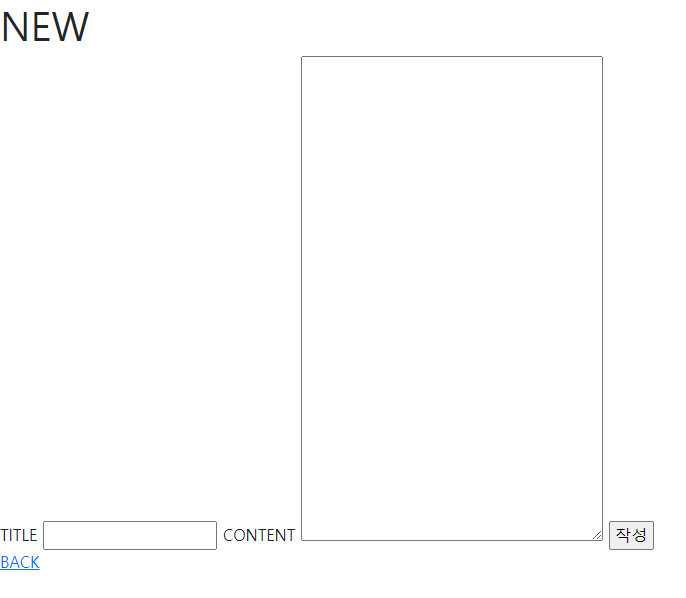

# Build_CRUD_Django

 

### 1. Overview

---

build CRUD with Django (python)

 

 

 

 

### 2. language & tool 

---

- python
- Django
- Visual studio Code
- Bootstrap

 

### 3. what functions can be served
---

- Create
- Read
- Update
- Delete

 

### 4. Reflection
---

- CRUD 게시판을 처음 만들어보았습니다. 아직 CSS, JavaScript이 미숙합니다
  - 추후에 UI 부분은 업데이트하겠습니다!

