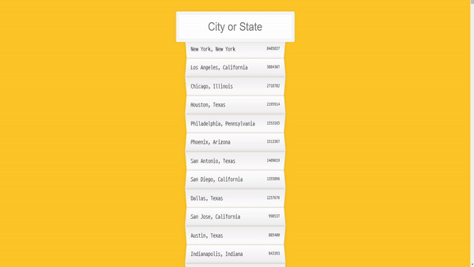

# Highlight Search_matched

 

### 1. Overview
---

검색어를 입력하면 해당 문자열이 포함된 것을 찾아준다.

 

### 2. language & tool 
---

- JavaScript(+HTML, CSS)
- Visual Studio Code

 

### 3. what functions can be served
---

- highlight matched strings

 

### 4. Note
---

- `keyup` : 이벤트리스너 동작 중 하나로 키를 떼는 순간을 나타낸다.
- `RegExp` : 정규식 생성자 (ex. 'gi' option을 줘서 대소문자 비교하지 않는다라는 표시를 할 수 있다)

  

